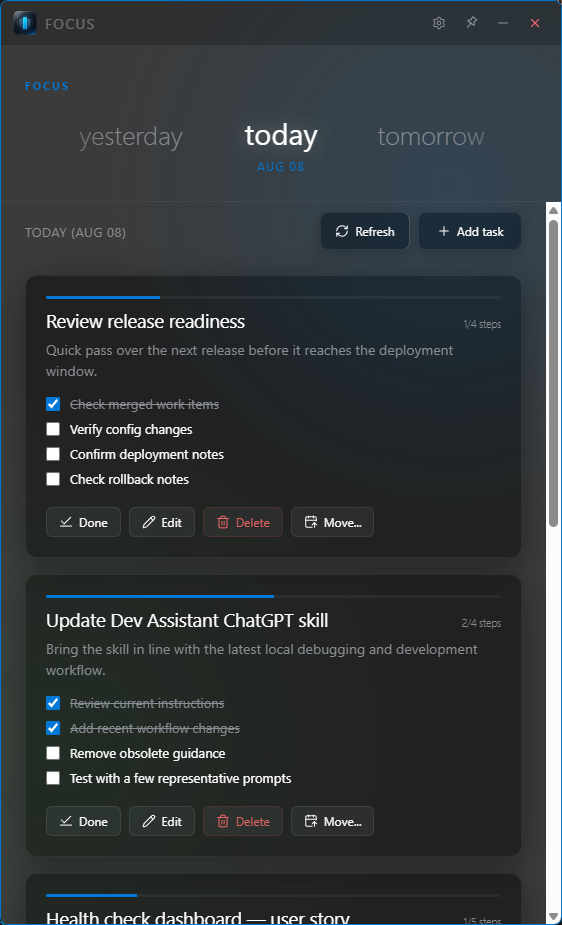

# Focus

A small Windows task companion built to keep today's work visible
without becoming another productivity system.

No accounts. No collaboration. No projects. No priorities.
No productivity scores. No AI assistant.

Just tasks, context, steps, and time.

## Why Focus?

I wanted a task list that could simply stay beside my work.

Most task applications eventually become systems of their own:
lists, projects, priorities, shared workspaces, dashboards, reminders,
and increasingly, AI features.

Focus deliberately doesn't.

It is a small desktop window that can stay on top while you work.
Open it, see what needs your attention, and get on with it.

And if there is nothing to do today:

> Enjoy your day.

An empty day is not a problem to solve.

## What it does

- Keeps tasks organized by day
- Supports optional context notes and steps
- Keeps completed tasks available for reopening
- Carries unfinished tasks forward
- Moves tasks between days
- Provides a horizontally scrolling date view
- Can stay always on top
- Stores everything locally in a single JSON file
- Lets you reveal that data file directly in Explorer
- Requires no account, service, or internet connection

## Design

Focus borrows from a period of Windows UI that I still have a soft
spot for: Windows 7 translucency, Metro / Windows Phone typography,
and the small desktop utilities that behaved more like companions
than destinations.

The interface combines a translucent dark window with large,
scrollable date navigation and deliberately restrained controls.

The goal is not nostalgia for its own sake. Those ideas happen to
work particularly well for an application whose job is to remain
visible without constantly demanding attention.

## Technology

Focus is intentionally small.

- Tauri 2
- HTML
- CSS
- Vanilla JavaScript
- Rust/Tauri native shell
- Local JSON persistence
- WebView2 on Windows

There is no frontend framework and no backend service.

Most of the application lives in a single `index.html`.

Yes, really.

## Data

Focus stores its task database locally as `tasks.json` in the
application configuration directory.

The exact location can be viewed from inside Focus, and the file can
be revealed directly in Windows Explorer.

There is no cloud synchronization or account.

Your tasks are a file on your computer.

## AI-assisted development

Focus was built as a personal utility and an experiment in
AI-assisted development.

Much of the implementation was generated with AI from my
requirements, UI direction, and iterative feedback. I supervised the
implementation, tested the application, made the product and design
decisions, and performed at-a-glance code review.

I do not claim that every line was manually written or deeply
reviewed.

The application itself contains no AI functionality and does not
communicate with an AI service.

## Building

### Requirements

- Node.js
- Rust
- Tauri 2 prerequisites for Windows
- WebView2

Install dependencies:

    npm install

Run the development build:

    npm run tauri dev

Create a release build:

    npm run tauri build

Tauri will produce the Windows installer artifacts under its normal
bundle output directory.

## Status

**1.0.0**

Focus began as a utility built for my own use. It is published here
because someone else may prefer a task list that does less, too.

## License

See [LICENSE](LICENSE).
